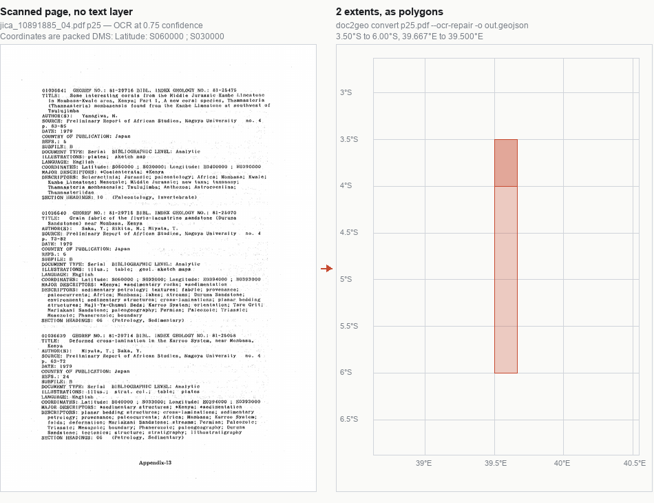
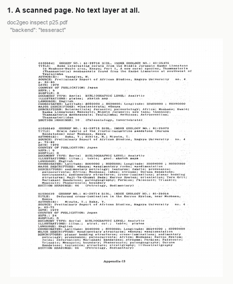
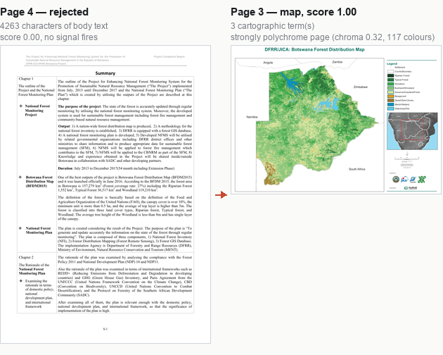
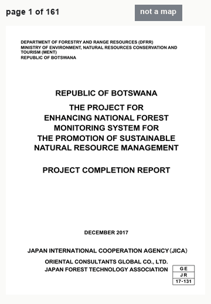
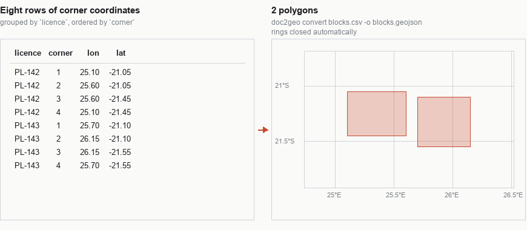

# doc2geo

Turn PDFs, scans, Word documents and spreadsheets into GeoJSON, Shapefiles and GeoPackages.

Geological and agricultural data arrives as documents. A soil survey is a scanned volume of
prose and profile forms; an exploration report is a hundred pages of text with four maps buried
in it; a drill register is a spreadsheet whose coordinates are in a datum nobody records twice.
`doc2geo` reads those, finds what is locatable, and writes it out as something a GIS can open.

It does not pretend to be certain. Every record carries the CRS it came from, the transformation
applied to it, and a confidence. When the library cannot tell, it says so rather than guessing
quietly.

```bash
pip install doc2geo            # GeoJSON and CSV out of PDFs, Word files and spreadsheets
pip install 'doc2geo[gdal]'    # adds Shapefile, GeoPackage, FlatGeobuf
pip install 'doc2geo[ocr]'     # adds OCR for scanned pages (needs the Tesseract binary)
```

## What it looks like

Every figure below is generated from the documents in [`samples/`](samples/README.md) by
[`docs/make_examples.py`](docs/make_examples.py), so they show what the library currently does
rather than what it did when someone last drew a diagram.

### A scanned page becomes polygons

A page of a JICA bibliography with no text layer at all. OCR reads it at 0.75 confidence, the
packed DMS coordinates are parsed per record, and each record's two latitudes and two longitudes
become an extent.



The four states of that page, one after another:



### Finding the map in a report

Page 3 of a 161-page forestry report is a Botswana forest distribution map. Page 4 is prose.
The detector scores the first 1.00 and the second 0.00, and prints why.



Walking the first ten pages of the same report, with the verdict on each:



### Corner coordinates become licence blocks

Eight rows, two licences, grouped by the `licence` column and ordered by `corner`:



## Extracting coordinates

```bash
doc2geo convert collars.xlsx -o collars.geojson
doc2geo convert report.pdf --crs "Arc 1950 / UTM zone 34S" -o sites.gpkg
doc2geo convert survey.csv --bbox 19.9,-26.95,29.4,-17.75 --strict
```

The output extension picks the format: `.geojson`, `.csv`, `.shp`, `.gpkg`, `.fgb`, `.gml`, `.kml`.

Coordinates are found two ways. Tables get their columns identified by name (`longitude`,
`easting`, `lat`, `utm_n`, …) or, where the headers are useless, by the shape of their values.
Prose gets scanned for the spellings people actually write: `21°34'12"S, 25°12'03"E`,
`-21.5701 25.2009`, `zone 34S 512345 mE 7612345 mN`.

## Points, lines and polygons

Documents rarely hand over a polygon. They hand over the corners of a licence block, one per
row, and expect you to know the rows belong together. `--geometry auto`, the default, assembles
them:

| In the document | Out |
| --- | --- |
| A `geom`/`wkt` cell holding `POLYGON((…))` | that geometry, reprojected if `--crs` says so |
| Rows grouped by `licence`, `block`, `claim`, `tenement` … | one **Polygon** per group |
| Rows grouped by `line`, `traverse`, `section` … | one **LineString** per group |
| Rows whose first and last vertex are identical | a **Polygon**, whatever the column is called |
| `Latitude: S060000 ; S030000  Longitude: E0340000 ; E0390000` | a **Polygon** for the extent |
| Anything else | **Points**, as before |

A `corner`, `seq` or `order` column sets the vertex order, so rows out of order in the
spreadsheet still close correctly. Rings are closed automatically if the source left them open.

The one thing it will not do is close a line. A group named `traverse` stays a `LineString`
even with a dozen vertices, because turning a survey path into a polygon invents area that was
never surveyed. Use `--geometry points` to switch the whole thing off and keep every row a
point.

`--bbox` is worth using. It is what catches the single most common failure in hand-built
coordinate tables — longitude and latitude in the wrong columns — because a swapped point
usually lands somewhere impossible:

```
1 record(s) -> sites.geojson  [openpyxl]
   warn  lon-lat-swapped: -21.87, 27.12 fits the area only if swapped
  error  systematic-swap: 14 records look swapped: check the column mapping
```

## Pulling the maps out of a report

Long reports carry a few map pages among the prose. `doc2geo maps` scores every page and
extracts the ones that are maps:

```bash
doc2geo maps report.pdf --list-only              # what it found, and why
doc2geo maps report.pdf -o map_pages --dpi 300   # write each map page as a PNG
doc2geo maps report.pdf -o map_pages --georeference
```

```
2 map page(s) in usgs_cp46.pdf:
  page   12  score 1.00  9 graticule tick labels; 1 cartographic term(s); dense monochrome
             graphics with little text (ink 0.20); landscape orientation; caption reads as a map
  page   35  score 0.57  26 graticule tick labels; little or no body text
```

No single signal decides. Graticule tick labels, cartographic vocabulary, page geometry against
the rest of the document, text density, embedded image count and — after a cheap 40 dpi render —
how polychrome the page is. A colour choropleth and a monochrome line map trip completely
different signals, which is why they are all weighed together and the reasons are printed. If the
threshold is wrong for your documents, move it with `--threshold`.

### Georeferencing, and when it refuses

`--georeference` reads the tick labels around the map frame, pairs each with its position on the
page, and fits a north-up affine transform. If the fit is good it writes a world file (`.pgw`)
and a `.prj` next to the PNG, and QGIS will open the page in place.

If the fit is poor it writes nothing and tells you why:

```
georeference: affine fit is off by up to 10.267° at the control points: the sheet is probably
projected, not plate carrée. Control points are provided; georeference it in QGIS.
```

That check matters. On a projected sheet, equal steps in latitude are not equal steps on paper —
ten degrees of the USGS Circum-Pacific map occupy twice the paper near the equator as they do at
20°N. An affine fitted to that produces a world file that looks plausible and is quietly wrong,
which is worse than no world file at all.

## What it can and cannot read

| Input | How |
| --- | --- |
| `.csv`, `.tsv` | delimiter sniffed, header detected |
| `.xlsx`, `.xlsm` | one table per sheet, via openpyxl |
| `.docx` | tables and paragraph prose, via python-docx |
| `.pdf` (born-digital) | text layer via pypdf |
| `.pdf` (scanned), images | OCR — needs the `ocr` extra and Tesseract, or a hosted service |

The honest limits:

- **A scanned page with no OCR backend yields nothing.** The library says so in `note` rather
  than returning an empty result as if the document were empty.
- **Bad scans lose hemisphere letters**, and a lost sign is the one error that moves a point to
  another continent while looking perfectly reasonable. By default those values are dropped.
  `--ocr-repair` will accept a glyph left in the letter's place (`$060000`, `5030000`) or take
  the hemisphere from a legible sibling in the same field — but only then, only with the axis
  label to constrain it, and always flagged as `ocr_repair_enabled` with the confidence cut. It
  supplies a missing hemisphere; it will never invent digits, so a record mangled worse than
  that is still dropped.
- **Monochrome scanned map sheets are the hardest case.** With no text layer and no colour, the
  detector is working from ink coverage and page geometry alone. Give it OCR and the graticule
  signal comes back.
- **`.xls` and `.doc`** are the pre-2007 binary formats and are not supported; re-save as
  `.xlsx`/`.docx`.

### Hosted OCR

Any service that takes a multipart upload and answers with blocks of text can be used, so no
particular vendor is baked in:

```bash
export DOC2GEO_OCR_URL=https://example.invalid/v1/documents
export DOC2GEO_OCR_TOKEN=...
doc2geo convert scanned_report.pdf --ocr http
```

Expected response shape: `{"blocks": [{"page": 1, "kind": "text", "text": "...", "confidence": 0.97}]}`.

## As a library

```python
from doc2geo import read, extract_records
from doc2geo.checks import check_records
from doc2geo.writers import write_geojson

extraction = read("report.pdf")
records = extract_records(extraction, crs_hint="Arc 1950 / UTM zone 34S")
report = check_records(records, bbox=(19.9, -26.95, 29.4, -17.75))

print(report.summary())
write_geojson([r for r in records if r.confidence > 0.8], "sites.geojson")
```

Every `Record` keeps its provenance, and it survives into the GeoJSON under `_doc2geo`:

```json
{
  "source_crs": "Arc 1950 / UTM zone 34S",
  "transform": "Inverse of Arc 1950 to WGS 84 (1) + UTM zone 34S",
  "accuracy_m": 1.0,
  "confidence": 0.95,
  "page": 7,
  "origin": "table:Appendix B row 12"
}
```

## Development

```bash
uv sync --extra ocr
uv run pytest
uv run ruff check src tests
uv run python docs/make_examples.py    # redraw the README figures
```

Tests marked `samples` run against real public reports, committed under
[`samples/`](samples/README.md) so they run without a network fetch:

```bash
uv run pytest -m samples
./samples/fetch.sh        # re-download the four with public URLs
```

Those documents are third-party publications included for testing; see
[samples/README.md](samples/README.md) for what each one is and why it earns its place.

Optional system tools: **poppler** (`pdftoppm`) for rendering and page extraction, **Tesseract**
for OCR. Both are found automatically when present and degraded around when absent.

## Licence

MIT. See [LICENSE](LICENSE).
